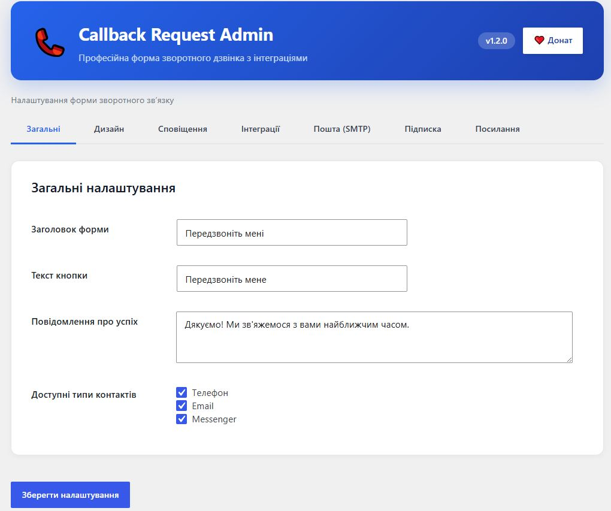
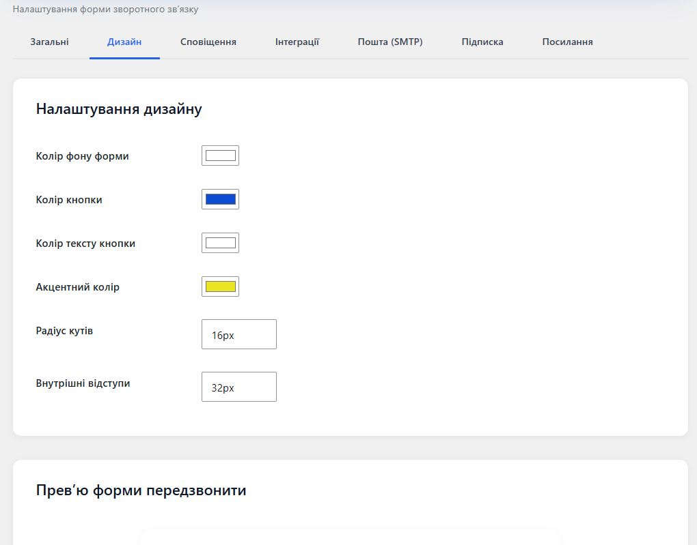
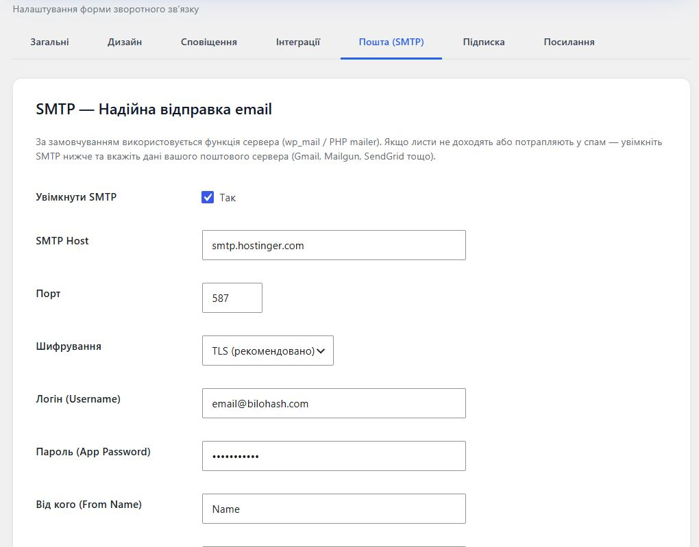
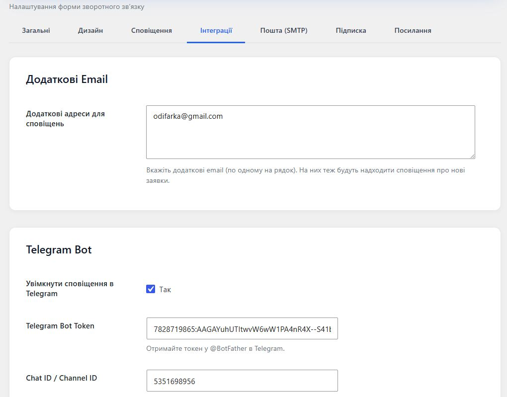
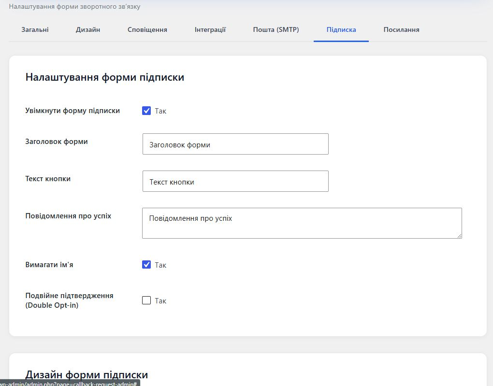
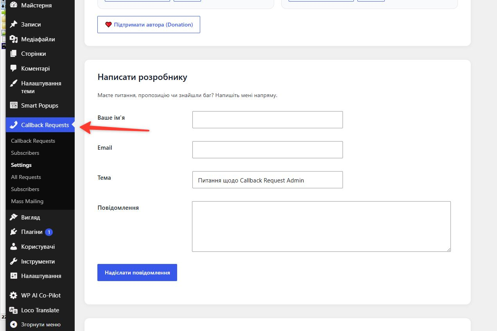
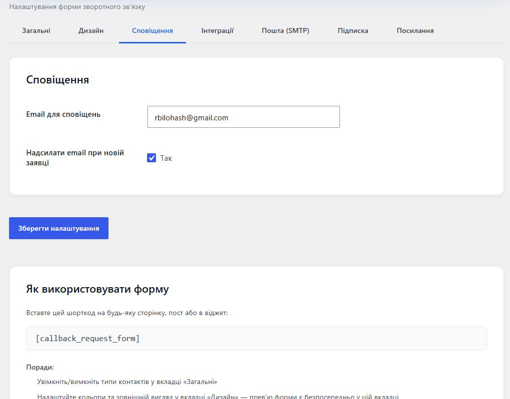

# Callback Request Admin

Професійна форма зворотного дзвінка з вибором типу контакту (Телефон / Email / Messenger), гнучким дизайном, сповіщеннями (Email + Telegram), формою підписки на розсилку та масовою розсилкою підписникам.

## Скріншоти

| Загальні налаштування | Дизайн + Прев'ю | Email (SMTP + тест) |
|-----------------------|-----------------|---------------------|
|  |  |  |

| Інтеграції | Підписка + Прев'ю | Посилання |
|------------|-------------------|-----------|
|  |  |  |

| Масова розсилка (з крутою шапкою та футером + вибір кольорів) |
|-------------------------------------------------------------|
|  |

> **Масова розсилка** має стильну шапку (кольоровий фон + логотип + тема) та футер (кольоровий фон + текст відписки). Кольори шапки та футера можна налаштувати безпосередньо у формі «Скласти та надіслати розсилку» для кожної конкретної розсилки.

## Особливості

- **Форма зворотного дзвінка** `[callback_request_form]`
  - Вибір типу контакту: Телефон, Email або Messenger (WhatsApp / Telegram / Viber)
  - Зберігання всіх заявок у власному CPT з зручним списком в адмінці
  - Живе прев'ю прямо у вкладці «Дизайн»

- **Форма підписки на розсилку** `[callback_subscribe_form]`
  - Окрема форма з власними налаштуваннями (заголовок, текст кнопки, повідомлення успіху, вимагати ім'я, double opt-in)
  - Окремий дизайн (власні кольори, радіус, відступи — незалежно від основної форми)
  - Зберігання підписників у окремому CPT
  - Прев'ю у вкладці «Підписка»

- **Потужна система дизайну**
  - Повний контроль кольорів, радіусу кутів та внутрішніх відступів
  - Окремий дизайн для форми підписки
  - Живе прев'ю при редагуванні

- **Сповіщення**
  - Основний email адміністратора + необмежена кількість додаткових адрес
  - Гарні HTML-листи з вашим логотипом, кольорами та футером
  - Вбудована кнопка **Тест Email**
  - Повна підтримка **SMTP** (з тестом)
  - Опціональні сповіщення в **Telegram**

- **Масова розсилка (Bulk Email)**
  - Окремий пункт меню **Callback Requests → Mass Mailing**
  - Надсилання всім активним підписникам одним кліком
  - Персоналізація `{name}` та `{email}`
  - **Крута шапка та футер** з можливістю налаштування кольору безпосередньо при складанні розсилки
  - Стилізація використовує глобальний логотип та текст футера з вкладки Email
  - Точна статистика успішних / невдалих відправлень

- **reCAPTCHA**
  - Вкладка «reCAPTCHA» у налаштуваннях
  - Підтримка Google reCAPTCHA v2
  - Можливість увімкнути/вимкнути окремо для форми зворотного дзвінка та форми підписки
  - Повна інтеграція (віджет на фронтенді + перевірка на сервері)

## Адміністративні меню та вкладки (з описами)

### Головне меню плагіна (Callback Requests)
- **Settings** — центральне місце всіх налаштувань (вкладки нижче)
- **All Requests** — список усіх заявок на дзвінок з фільтрами та кастомними колонками
- **Subscribers** — список усіх підписників розсилки
- **Mass Mailing** — окрема потужна сторінка для масової розсилки (з крутою шапкою та футером + налаштування їх кольорів)

### Вкладки в Settings
- **Загальні** — заголовок, текст кнопки, повідомлення успіху, які типи контактів показувати
- **Дизайн** — кольори, радіус, відступи + живе прев'ю **основної форми** зворотного дзвінка
- **Сповіщення** — куди надсилати email-сповіщення (основний + додаткові адреси)
- **Інтеграції** — налаштування Telegram для миттєвих сповіщень
- **Пошта (SMTP)** — конфігурація SMTP + тест відправки + глобальний дизайн email-листів (шапка, футер, логотип, кольори)
- **Підписка** — параметри форми підписки + **окремий дизайн** (власні кольори шапки/кнопки/футера)
- **reCAPTCHA** — інтеграція Google reCAPTCHA з можливістю вмикати/вимикати для кожної форми окремо
- **Посилання** — інші плагіни Bilohash, форма написати розробнику (email@bilohash.com), посилання на відгуки та підтримку

### Mass Mailing (окремий пункт меню)
- Підрахунок активних підписників
- **Скласти та надіслати розсилку** (тема + текст)
- **Налаштування кольору шапки та футера** саме для цієї розсилки
- **Крутий попередній перегляд** з сучасною шапкою (кольоровий фон + логотип + тема) та футером (кольоровий фон + текст відписки)
- Надсилання з тими ж стилями + детальна статистика результатів

- **Зручне адміністрування**
  - Вкладки: Загальні, Дизайн, Сповіщення, Інтеграції, Пошта (SMTP), Підписка, reCAPTCHA, Посилання
  - Окремий пункт меню «Mass Mailing»
  - Кастомні колонки та швидкий огляд заявок і підписників

## Встановлення

1. Завантажте плагін у `/wp-content/plugins/callback-request-admin/`
2. Активуйте через меню «Плагіни»
3. Перейдіть у **Callback Requests → Settings**
4. Налаштуйте вкладки (детальні описи нижче)
5. Використовуйте шорткоди:
   - `[callback_request_form]`
   - `[callback_subscribe_form]`

## Шорткоди

- `[callback_request_form]` — форма зворотного дзвінка
- `[callback_subscribe_form]` — форма підписки на розсилку

## Адміністративні меню та вкладки

### Головне меню «Callback Requests»
- **Settings** — всі налаштування плагіна (вкладки нижче)
- **All Requests** — список усіх заявок на дзвінок
- **Subscribers** — список усіх підписників розсилки
- **Mass Mailing** — окрема сторінка для масової розсилки підписникам (з крутою шапкою та футером листа + вибір кольорів)

### Вкладки в Settings

**Загальні**  
Основні параметри форми зворотного дзвінка: заголовок, текст кнопки, повідомлення про успіх, доступні типи контактів (Телефон/Email/Messenger).

**Дизайн**  
Налаштування зовнішнього вигляду **основної форми** зворотного дзвінка: кольори фону, кнопки, акценту, радіус кутів, відступи. Живе прев'ю форми прямо у вкладці.

**Сповіщення**  
Email для сповіщень, додаткові адреси, увімкнення email-повідомлень при нових заявках.

**Інтеграції**  
Налаштування Telegram-ботів для миттєвих сповіщень про нові заявки та підписки.

**Пошта (SMTP)**  
Повна конфігурація SMTP (хост, порт, шифрування, логін, пароль, From Name/Email).  
Вбудований **тест відправки** з відображенням останньої помилки.  
Дизайн усіх вихідних листів (шапка, акцент, логотип, футер).

**Підписка**  
Налаштування форми підписки на розсилку (заголовок, кнопка, успіх, вимагати ім'я, double opt-in).  
**Окремий дизайн** форми підписки (власні кольори, радіус, відступи).  
Прев'ю форми підписки.  
Шорткод та посилання на список підписників.

**reCAPTCHA**  
Інтеграція Google reCAPTCHA v2 для захисту від спаму.  
- Глобальне увімкнення  
- Site Key та Secret Key  
- Окреме увімкнення для форми зворотного дзвінка та форми підписки  
- Повна перевірка на сервері при відправці

**Посилання**  
- Інші плагіни від Bilohash (з посиланнями на WP.org та відгуки)  
- Форма написати розробнику (на email@bilohash.com)  
- Посилання на відгуки та сторінки підтримки плагінів на WordPress.org

### Mass Mailing (окремий пункт меню)
Крута сторінка для масової розсилки:
- Підрахунок активних підписників
- Скласти розсилку (тема + текст з плейсхолдерами)
- **Налаштування кольору шапки та футера** саме для цієї розсилки
- **Крутий попередній перегляд** з красивою шапкою (кольоровий фон + логотип + тема) та футером (кольоровий фон + текст відписки + глобальний футер)
- Надсилання з тими ж стилями
- Детальна статистика результатів

## reCAPTCHA інтеграція
1. Отримайте ключі на [Google reCAPTCHA](https://www.google.com/recaptcha/admin) (рекомендовано v2 Checkbox).
2. У вкладці **reCAPTCHA** введіть Site Key та Secret Key.
3. Увімкніть галочки для потрібних форм.
4. На фронтенді з'явиться віджет reCAPTCHA.
5. При відправці токен перевіряється на сервері перед обробкою форми.

Можна вмикати/вимикати незалежно для форми зворотного дзвінка та форми підписки.

## Часті питання

**Чи можна використовувати обидві форми на одній сторінці?**  
Так. Кожна форма використовує власні налаштування дизайну та (за потреби) власний reCAPTCHA.

**Чи впливає дизайн підписки на основну форму?**  
Ні. Для підписки тепер окремі налаштування кольорів.

**Чи зберігаються дані підписників?**  
Так, у власному CPT `callback_subscriber` з можливістю масової розсилки.

## Розробник
- Email: [email@bilohash.com](mailto:email@bilohash.com)
- Сайт: [bilohash.com](https://bilohash.com)
- Інші плагіни: [AI Chat Consultant](https://wordpress.org/plugins/bilohash-ai-chat-consultant/), [Smart Popups](https://wordpress.org/plugins/bilohash-smart-popups/)

## Ліцензія
GPLv2 or later

---

**Сподобався плагін?** Залиште відгук на WordPress.org та підтримайте автора! ❤️

*Callback Request Admin — професійні форми зворотного зв'язку та розсилок для вашого сайту.*
